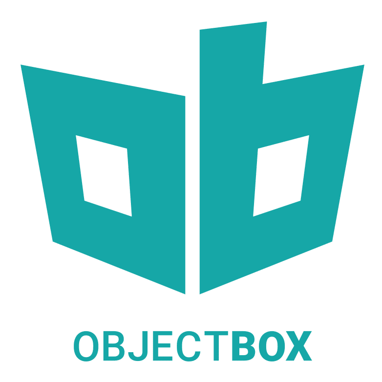
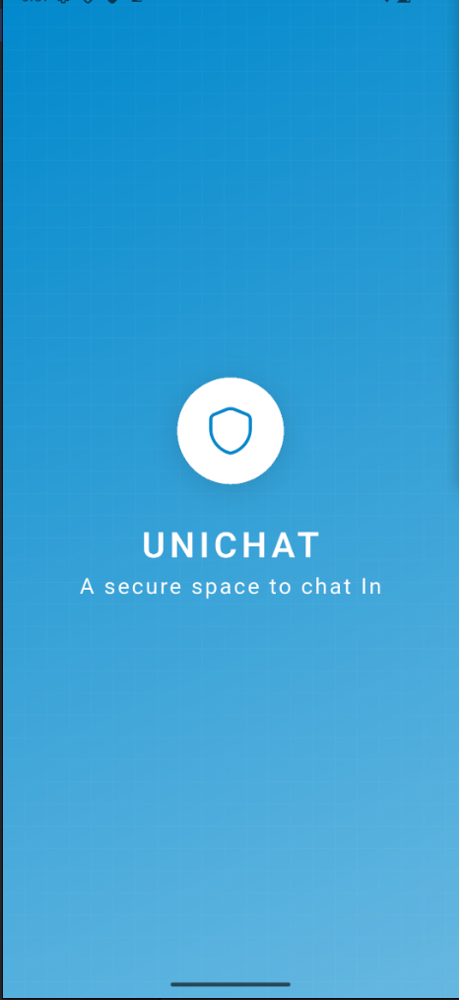

# UniChat - Secure Messaging System

    
    
    
    
    

## Overview

**UniChat** is a secure messaging app that implements **End-to-End Encryption (E2EE)** to ensure the confidentiality and integrity of communications. The app is designed to protect users' messages from unauthorized access, both during transit and storage.

## Key Features

- **End-to-End Encryption**: Messages are encrypted on the sender's device and only decrypted on the recipient's device.
- **Real-time Messaging**: Powered by **Pusher** for instant delivery of messages.
- **Cross-Platform**: Built with **Flutter** for a responsive, mobile experience on iOS and Android.
- **Secure Backend**: **Laravel** is used for managing users, authentication, and secure data storage.

## Technologies Used

- **Flutter**: Cross-platform mobile framework
- **Laravel**: Backend framework for user management and secure storage
- **Pusher**: Real-time messaging system

## Goals

- Implement End-to-End Encryption for privacy.
- Provide a user-friendly messaging experience.
- Continuously improve security and functionality.

    

